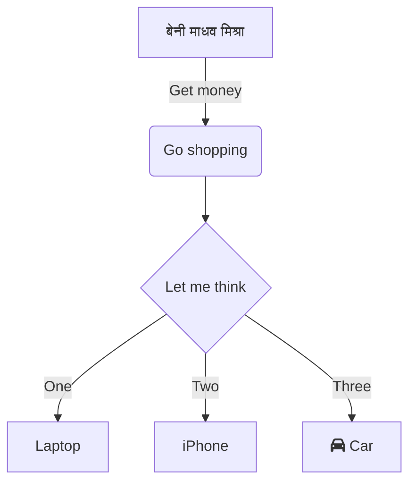
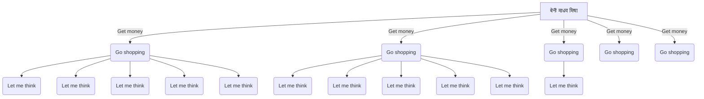

# portfolio

```mermaid
flowchart TD
    A[" बेनी माधव मिश्रा "] -->|Get money| B(Go shopping)
    B --> C{Let me think}
    C -->|One| D[Laptop]
    C -->|Two| E[iPhone]
    C -->|Three| F[fa:fa-car Car]
```

```mermaid
flowchart TD
    A[बेनी माधव मिश्रा] -->|Get money| B(Go shopping)
    A[बेनी माधव मिश्रा] -->|Get money| C(Go shopping)
    A[बेनी माधव मिश्रा] -->|Get money| D(Go shopping)
    A[बेनी माधव मिश्रा] -->|Get money| E(Go shopping)
    A[बेनी माधव मिश्रा] -->|Get money| F(Go shopping)
    B --> BA(Let me think)
    B --> BB(Let me think)
    B --> BC(Let me think)
    B --> BD(Let me think)
    B --> BE(Let me think)
    C --> CA(Let me think)
    C --> CB(Let me think)
    C --> CC(Let me think)
    C --> CD(Let me think)
    C --> CE(Let me think)
    D --> DD(Let me think)
    
```
