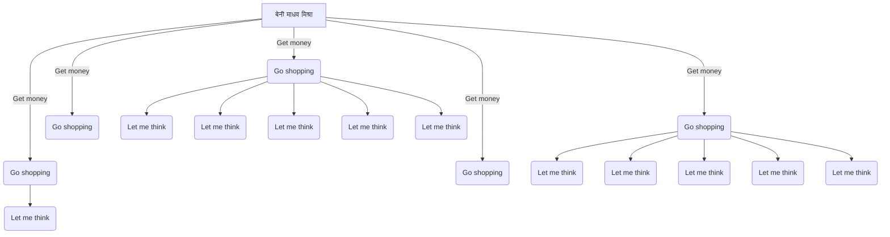
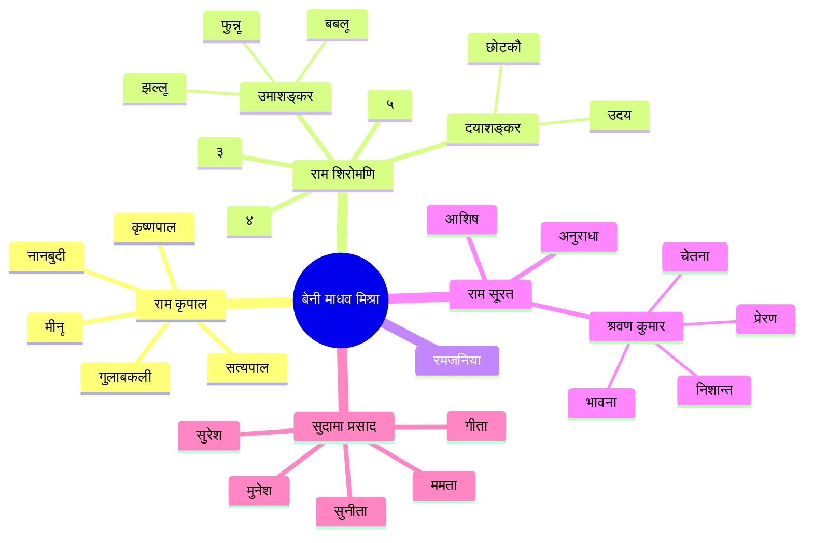

# portfolio

```mermaid
flowchart TD
    A[बेनी माधव मिश्रा] -->|Get money| B(Go shopping)
    A[बेनी माधव मिश्रा] --->|Get money| C(Go shopping)
    A[बेनी माधव मिश्रा] ---->|Get money| D(Go shopping)
    A[बेनी माधव मिश्रा] --->|Get money| E(Go shopping)
    A[बेनी माधव मिश्रा] ---->|Get money| F(Go shopping)
    B --> BA(Let me think)
    B --> BB(Let me think)
    B --> BC(Let me think)
    B --> BD(Let me think)
    B --> BE(Let me think)
    C --> CA(Let me think)
    C --> CB(Let me think)
    C --> CC(Let me think)
    C --> CD(Let me think)
    C --> CE(Let me think)
    D --> DD(Let me think)
    
```

```mermaid
mindmap
  root((बेनी माधव मिश्रा))
    राम कृपाल
        सत्यपाल
        कृष्णपाल
        गुलाबकली
        नानबुदी
        मीनू
    राम शिरोमणि
        दयाशङ्कर
            उदय
            छोटकौ
        उमाशङ्कर
            बबलू
            झल्लू
            फुन्नू
        ३
        ४
        ५

    रमजनिया 
    राम सूरत
        अनुराधा
        श्रवण कुमार
            चेतना 
            भावना
            प्रेरण
            निशान्त
        आशिष

    सुदामा प्रसाद
        सुरेश
        मुनेश
        सुनीता
        गीता
        ममता
      
    
```
